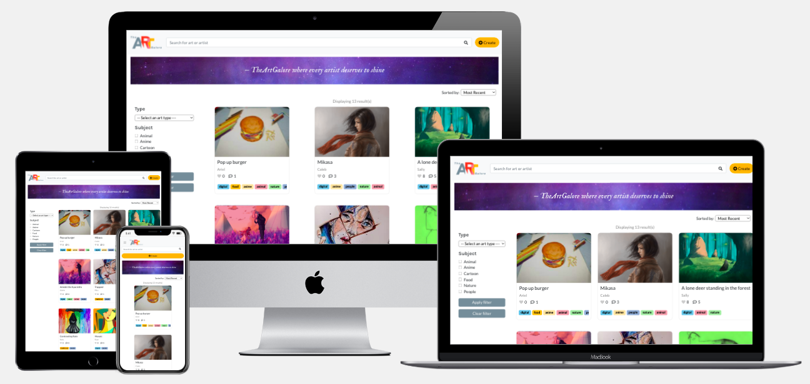

# The Art Galore

 

Access the live demo of the website [here](https://wonderful-turing-7905df.netlify.app).

## Project Summary

**Project Context**

The Art Galore(TAG) is a mobile-responsive open platform for artists to browse through art, leave reviews for art, and also share their art with the public.

**Organisational Goals**

The web app aims to promote the freedom of sharing art with the public and encourage exchanging of constructive art reviews within the art community. Artist can make use of the reviews provided to further improve on their art skills. 

**User Goals**

The aim of users is to gather reviews for their art. These reviews can be helpful in pinpointing the areas they can work on.

**Justification for the App**

Many art platforms provides a platform for people to post and share their art however this art platform encourages leaving reviews to help artist grow. The process of creating reviews is simplified through the features implemented (e.g. reviews can be created in a single click, messages throughout the website encouraging users to leave a review)

## Project Complexity

Access the Project Complexity Matrix [here](https://github.com/kshannn/react_art_gallery/blob/master/public/project_complexity.pdf).

## UX/UI

### **Stategy**

_Organisation_
* Objective: Provide a service platform to encourage sharing of art and constructive reviews within the art community

_User_
* Objective: To get reviews for the art that they shared so that they can identify the areas to improve on

* Needs: An art platform that allow users to easily post their art and get reviews

* Demographics:
    * Artists who do digital/traditional art and are seeking to improve on their art skills based on public feedback
    * Sufficient literacy in using technological devices

* Pain point: Can be difficult to gain constructive feedback from other platforms 

User Stories | Acceptance Criteria(s)
------------ | -------------
As an artist who is looking for feedback on my art, I want to be able to easily post my art onto a platform where I can gain feedback so that I can improve on my art based on them  | Feature that allows ease of posting art
As a person who is looking to browse through art, I want to be able to easily search for art from specific categories so that I can narrow down to the results that I want quickly. | Feature that display multiple art posts and allow filtering or searching based on certain criterias

### **Scope**
_Functional Specifications_
* Create, read, update, delete art posts

* Create, read, update, delete reviews

* Search for art posts

* Sort art posts

* Filter art posts

_Content requirements_

* Details about the art posts (e.g. name of poster, title of art, art type, art subject, description of art, date posted etc.)

* Details about the reviews (e.g. name of reviewer, date posted, content of review)

_Non-functional requirements_
* Mobile responsiveness
    * Achieved via the use of bootstrap media queries,bootstrap grid columns, and flex box

* Performance

### **Structure**

 

* When user loads the website, they will land on the art gallery page which displays the art posts. Users can use the search filter, sorting dropdown selection, and search bar to narrow and/or sort their results.

* Users would also see a hero image with words that highlight the mission of web app. This helps users to understand what the website is about.

* Users can create an art post by clicking on the create button at the top of the screen. This directs them to a page where they can fill up information about the art they wish to post. Upon submission of the art details, they would be redirected to the gallery page to see their updated art post there.

* Clicking on a particular art post would direct users to a page with more details about the art post such as the description and reviews associated with it. They have the option to edit or delete the art post through a small dropdown menu. Furthermore, users can create a review for the art post by filling up their name, review details, and clicking post in the form on the art post page.

* Clicking on edit art post or edit review button would cause a page or popup box to appear respectively. Saving the made change would return user to the art page.

* The app uses language that is easy for users to understand and contains no technical jargons

### **Skeleton**
Access the wireframes for small, medium, and large devices for the website [here]()

### **Surface**

_Colours_

 

* The main colours used to design the website are based on the colours in the logo. The colours consist of different shades of red, blue, and yellow which are primary colours. As all colours can be created from primary colours, it is a fitting palette for an art website as it suggests to users that they can create wonderful art even with the simplest palette.

_Font Choice_
* Majority of the font used throughout the website is san-serif to match the brand logo. The use of san-serif also makes words easier to read. Only the words in the hero image is in serif for aesthetic purposes.

## Features

1. **Users can create, update, and delete art posts.** With just a click on the "create" button, users are directed to a form page where they can fill up the details to make their art post. Their new art would then be updated in the gallery page. Once a user has clicked into a particular art post, they are able to edit or delete the art post through a dropdown button represented by an ellipses icon. This feature is implemented through calling of API endpoints.

2. **Users can create, update, and delete reviews.** Users can easily leave reviews for an art post by clicking into a particular art post and filling up the review form immediatelly. This feature encourages users to leave reviews with a call-to-action message "Help out another fellow artist by leaving a review!" and remove "roadblocks" having the form on the same page, thereby making it easier for users to create a review with a single click. Users are also able to update and delete reviews through a dropdown button represented by an ellipses icon. This feature is implemented through calling of API endpoints.

3. **Users can quickly search for an art post by the name of the artist or the art title.** In the event that users already have an art or an artist that they want to search for, they could do so easily by searching their query with the search bar. This feature is implemented by calling the API GET endpoint and setting the criterias.

4. **Users can filter art appearing on their gallery based on the art type and art subject.** This feature can be useful if users only wish to retrieve art results of a particular search criteria. For example, users can filter out all the traditional arts and retrieve only arts that are tagged as "digital art". This feature is implemented by calling the API GET endpoint and setting the criterias.

5. **Users can sort art appearing on their gallery based on the most recent, most liked, and most reviewed.** This feature provides a solution for users who wish to organize their search results. This is implemented using a bubble sort on the retrieved data.

6. **Section in every art page dedicated to showing other arts in the form of thumbnail.** This feature allows users to be able to navigate to other arts more easily. Through such implementation, users would be more likely to visit other art work and as a result increase their likelihood of leaving a review. This feature is implemented by calling the API GET endpoint.

_Limitations and future implementations_
* In the future, I would like to implement pagination so that users can click through the pages to browse the art posts instead of scrolling. This also relieves the load on the database and web application by limiting the number of results returned.

* In the future, I would like to implement a user account feature so as to keep track of the art posted, reviews made, and posts liked by each user. To further encourage reviews from users, I would also like to implement a point system whereby users will gain points to unlock site benefits upon leaving a review on an art post. This is possible to keep track with the implementation of a user account feature.

## Testing

**Test Cases**

Access the test cases [here]().

**Testing for Mobile Responsiveness**

## Technologies Used
* HTML5
    * To create import CDN for Bootstrap and Font Awesome
* CSS3
    * To style various elements throughout the web app
* JavaScript
    * To include interactive elements throughout the web app

* [React](https://reactjs.org/)
    * To create a single page application by manipulating state variables

* [Bootstrap v5.0.1](https://getbootstrap.com/docs/5.0/getting-started/introduction/)
    * For offcanvas, alerts, navbar templates

* [Git](https://git-scm.com/)
    * For version control

* [GitHub](http://github.com)
    * To create repository and store source code

* [Balsamiq Mockups 3](https://balsamiq.com/)
    * To create wireframes

* [Heroku](https://id.heroku.com/login)
    * To enable access to database

* [Netlify](https://www.netlify.com/)
    * To deploy React application

* [Google Font](https://fonts.google.com/)
    * To select font families used for web app (i.e. IM Fell English, Lato, Karla)
* [Multi Device Website Mockup Generator](https://techsini.com/multi-mockup/index.php)
    * To display screen-responsiveness of website across different devices

## Deployment

The web app is hosted using Heroku (for Express NodeJS) and Netlify (for React).

**Steps to deployment using Heroku**

**Steps to deployment using Netlify**

## Dependencies

* [MongoDB](https://www.mongodb.com/)
    * To store data

* [Axios](https://cdnjs.com/libraries/axios)
    * To call API

## Credits

* Brand logo 
    * Taken and edited from [Artist Repetory Theatre's website]([https://artistsrep.org/announcing-arts-new-logo-and-branding/](https://artistsrep.org/announcing-arts-new-logo-and-branding/) (Art logo edited))

* Design of website inspired by [DeviantArt](https://www.deviantart.com/)
