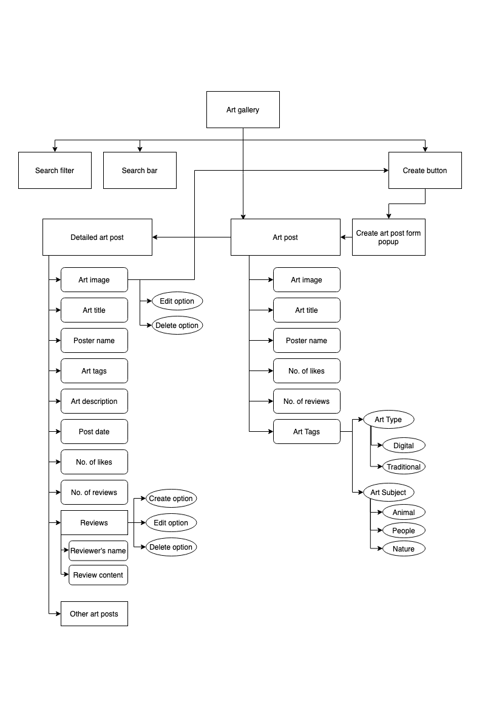

# The Art Galore

## Project Summary
**Project Context**
The Art Galore(TAG) is a mobile-responsive open platform for artists to browse through art, leave reviews for art, and also share their art with the public.

**Organisational Goals**
The web app aims to promote the freedom and idea of sharing art to the public and exchanging constructive feedback in the art community. Through providing and receiving reviews, artist can make use of the feedback to improve on their art. 

**User Goals**
The aim of users is to gather reviews for their art. These reviews can be helpful in helping them pinpoint the areas they can work on.

**Justification for the App**
Many art platforms provides a platform for people to post and share their art however this art platform encourages leaving reviews to help artist grow. Creation of art post and reviews are made easy through the features implemented (e.g. art post and reviews can be made within a single click)

## Project Complexity

## UX/UI
### **Stategy**
_Organisation_
* Objective: Provide a platform to encourage sharing of constructive feedback within the art community

_User_
* Objective: To get reviews for the art that they shared

* Needs: An art platform that encourages reviews

* Demographics:
    * Artists who do digital/traditional art and seeking for improvement from public feedback
    * Sufficient literacy in using technological devices

* Pain point: Can be difficult to get constructive feedback from other platforms 

User Stories | Acceptance Criteria(s)
------------ | -------------
As an artist who is looking for feedback on my art, I want to be able to easily post my art onto a platform where I can gain feedback so that I can improve on my art based on them  | Feature that allows ease of posting art

### **Scope**
_Functional Specifications_
* Create, read, update, delete art posts

* Create, read, update, delete reviews

* Search for art post 

* Filter art post

_Content requirements_

* Details about the art post (e.g. name of poster, title of art, description of art, date posted etc.)

* Details about the reviews (e.g. name of reviewer, date posted, content of review)

_Non-functional requirements_
* Mobile responsiveness
    * Achieved via the use of bootstrap media queries,bootstrap grid columns, and flex box
* Performance

### **Structure**

 

* TAG web application is structured using a ___ .

* The app uses language that is easy for users to understand and contains no technical jargons

### **Skeleton**

### **Surface**

## Features

1. Users can create, update, and delete art posts
2. Users can create, update, and delete reviews
3. Users can quickly search for an art post by the name of the artist or the art title
4. Users can filter art appearing on their gallery based on the art type and art subject

_Limitations and future implementations_

## Testing

# Getting Started with Create React App

This project was bootstrapped with [Create React App](https://github.com/facebook/create-react-app).

## Available Scripts

In the project directory, you can run:

### `yarn start`

Runs the app in the development mode.\
Open [http://localhost:3000](http://localhost:3000) to view it in the browser.

The page will reload if you make edits.\
You will also see any lint errors in the console.

### `yarn test`

Launches the test runner in the interactive watch mode.\
See the section about [running tests](https://facebook.github.io/create-react-app/docs/running-tests) for more information.

### `yarn build`

Builds the app for production to the `build` folder.\
It correctly bundles React in production mode and optimizes the build for the best performance.

The build is minified and the filenames include the hashes.\
Your app is ready to be deployed!

See the section about [deployment](https://facebook.github.io/create-react-app/docs/deployment) for more information.

### `yarn eject`

**Note: this is a one-way operation. Once you `eject`, you can’t go back!**

If you aren’t satisfied with the build tool and configuration choices, you can `eject` at any time. This command will remove the single build dependency from your project.

Instead, it will copy all the configuration files and the transitive dependencies (webpack, Babel, ESLint, etc) right into your project so you have full control over them. All of the commands except `eject` will still work, but they will point to the copied scripts so you can tweak them. At this point you’re on your own.

You don’t have to ever use `eject`. The curated feature set is suitable for small and middle deployments, and you shouldn’t feel obligated to use this feature. However we understand that this tool wouldn’t be useful if you couldn’t customize it when you are ready for it.

## Learn More

You can learn more in the [Create React App documentation](https://facebook.github.io/create-react-app/docs/getting-started).

To learn React, check out the [React documentation](https://reactjs.org/).

### Code Splitting

This section has moved here: [https://facebook.github.io/create-react-app/docs/code-splitting](https://facebook.github.io/create-react-app/docs/code-splitting)

### Analyzing the Bundle Size

This section has moved here: [https://facebook.github.io/create-react-app/docs/analyzing-the-bundle-size](https://facebook.github.io/create-react-app/docs/analyzing-the-bundle-size)

### Making a Progressive Web App

This section has moved here: [https://facebook.github.io/create-react-app/docs/making-a-progressive-web-app](https://facebook.github.io/create-react-app/docs/making-a-progressive-web-app)

### Advanced Configuration

This section has moved here: [https://facebook.github.io/create-react-app/docs/advanced-configuration](https://facebook.github.io/create-react-app/docs/advanced-configuration)

### Deployment

This section has moved here: [https://facebook.github.io/create-react-app/docs/deployment](https://facebook.github.io/create-react-app/docs/deployment)

### `yarn build` fails to minify

This section has moved here: [https://facebook.github.io/create-react-app/docs/troubleshooting#npm-run-build-fails-to-minify](https://facebook.github.io/create-react-app/docs/troubleshooting#npm-run-build-fails-to-minify)
